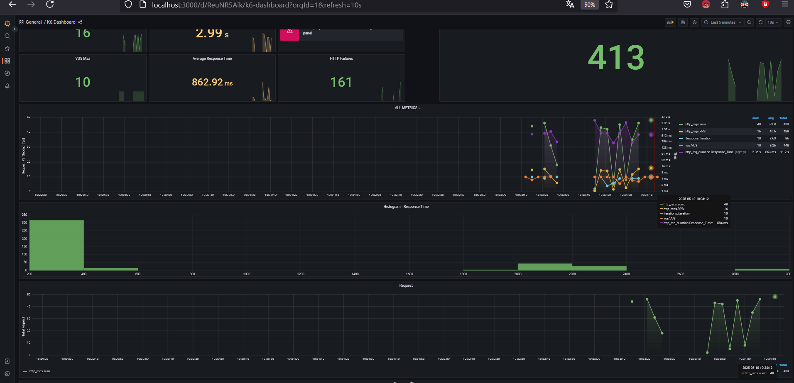

# 🚀 tray-challenge

Este repositório contém o desafio automatizado utilizando [Cypress](https://www.cypress.io/) e [k6](https://k6.io/).

## ✅ Tudo Rodando


## 🏆 Boas Práticas
- **Reutilização de métodos**: Funções e comandos desenvolvidos com foco na reutilização e manutenção.
- **Arquitetura escalável**: Estrutura de pastas e arquivos organizada para facilitar a escalabilidade do projeto.
- **Uso de constantes**: Evita duplicação de valores por meio da centralização de constantes reutilizáveis.
- **Separação de variáveis de ambiente**: Utilização de arquivos separados para armazenar secrets e variáveis sensíveis.  
  > ⚠️ **Nota**: Como este é um projeto de desafio, o arquivo `cypress.env.json` foi incluído no repositório apenas para fins de demonstração. Em um ambiente real, esse tipo de arquivo seria adicionado ao `.gitignore` e mantido fora do controle de versão.


## 📦 Configuração do Ambiente

### 🔹 Clonar o Repositório e Instalar Dependências
1. Certifique-se de ter o **Node.js**, **Git**, **k6** e o **Docker** (opcional) instalados em sua máquina.
2. Clone o repositório:
   ```bash
   git clone https://github.com/Direnzii/tray-challenge.git
   ```
3. Acesse a pasta do projeto e instale as dependências:
   ```bash
   cd tray-challenge
   npm install
   ```

---

## 🧪 Teste E2E (Cypress)

### 🚀 Teste Executado


### ▶️ Como Executar os Testes
- Executar todos os testes via CLI:
  ```bash
  npx cypress run
  ```
- Executar uma spec específica:
  ```bash
  npx cypress run --spec ./cypress/e2e/<nome-da-spec>.cy.js
  ```
  - Substitua `<nome-da-spec>` pelo nome do arquivo de teste que deseja rodar.

### 💡 Dicas
- Você pode abrir o Cypress em modo interativo com:
  ```bash
  npx cypress open
  ```

### 🤖 Uso de IA
Utilizei IA apenas para reescrever este README de forma mais estruturada e visualmente agradável.


---

## 🔗 Teste de API (k6)

### ✅ Teste Executado


### ▶️ Como Executar os Testes
- Executar todos os testes via CLI:
  ```bash
  k6 run .\starWarsTest\main.js
  ```

### 💡 Dicas

Para facilitar a visualização dos resultados dos testes, foi configurado um ambiente com **Docker Compose**, que executa um banco de dados e o **Grafana** localmente. Com poucos passos, é possível criar dashboards personalizados para análise:

1. **Suba os containers**:
   ```bash
   docker compose up -d
   ```

2. **Acesse o Grafana** em: [http://localhost:3000](http://localhost:3000)

3. **Adicione uma fonte de dados (Data Source)**:
   

4. **Configure a conexão com o banco de dados**:
   

5. **Importe um dashboard pronto para visualização dos testes com k6**:
   - Acesse a opção de importação de dashboards.
   - Utilize o **ID: `14801`** para carregar o modelo usado no vídeo demonstrativo.
   

6. **Visualização final no Grafana**:
   


### 🤖 Uso de IA
Utilizei IA em dois momentos:
- Para solucionar um erro de certificado da API no k6:  
  
- Para validar entradas usando Regex (nunca decoro Regex 🙃)  
  
